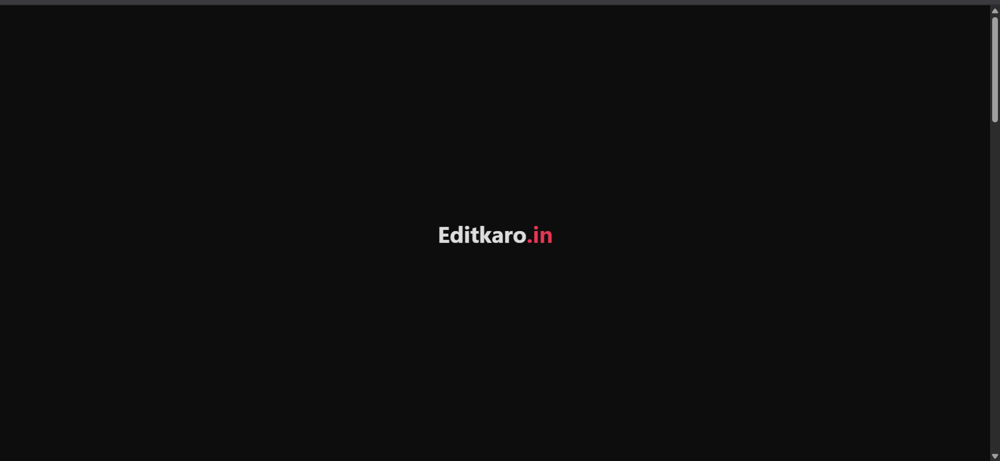
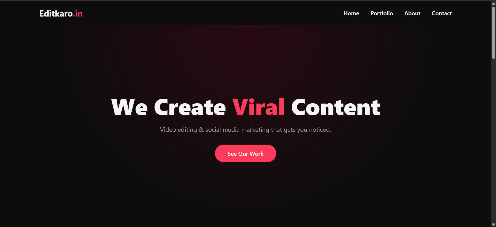
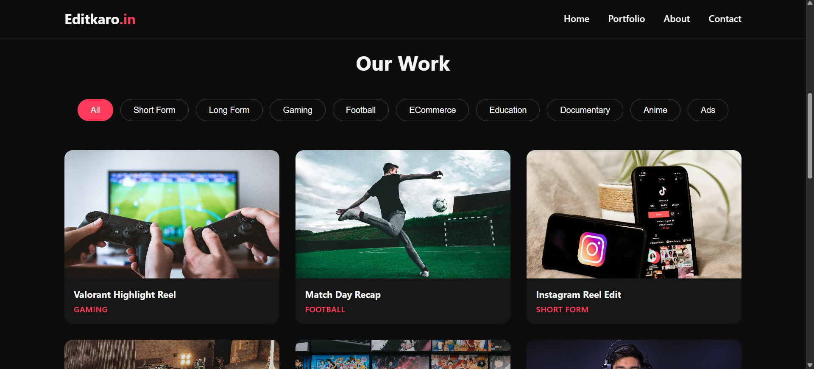
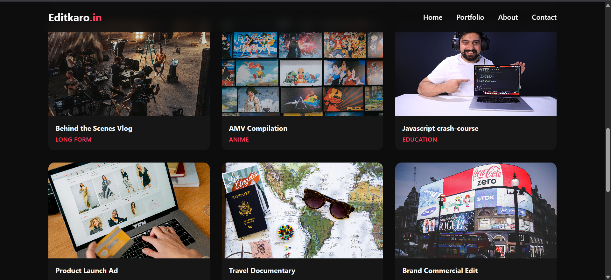
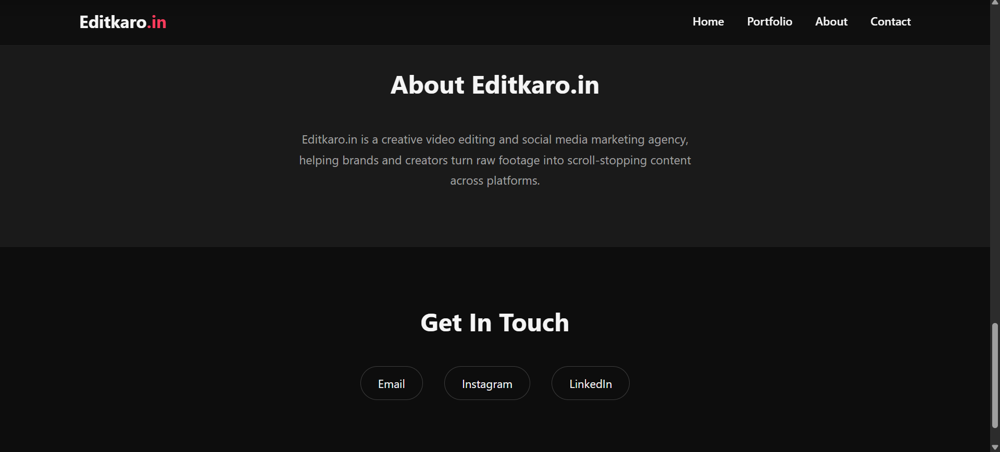
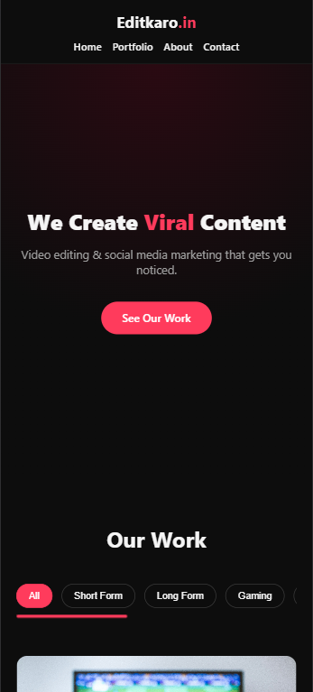
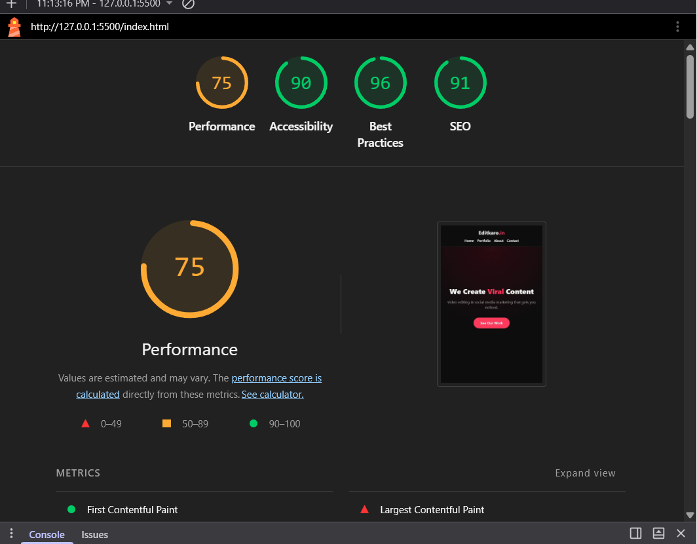

# 🎬 Editkaro.in — Video Editing & Social Media Agency Portfolio

A modern, responsive, and interactive portfolio website built for **Editkaro.in**, a video editing and social media marketing agency. This project showcases different categories of video editing work using embedded YouTube videos, dynamic filtering, and a clean user interface.

🌐 **Live Demo:** https://editkaro-portfolio-silk.vercel.app/

📂 **GitHub Repository:** https://github.com/kaushalvivek2005/editkaro-portfolio

---

# 📖 Project Overview

This project was developed as part of the **VaultofCodes Web Development Internship**.

The objective was to design and develop a responsive portfolio website using **HTML**, **CSS**, and **Vanilla JavaScript**. The website showcases different categories of edited videos with smooth animations, interactive filtering, and embedded YouTube video previews.

---

# ✨ Features

- 📱 Fully Responsive Design
- 🎯 Dynamic Category Filtering
- ▶️ Embedded YouTube Video Popup
- 🎓 Education Video Showcase
- 🎨 Modern Dark Theme
- 🖱️ Interactive Hover Effects
- ✨ Smooth Scroll Animations
- 📜 Smooth Navigation
- 🃏 Responsive Portfolio Cards
- ⚡ Lightweight (No Frameworks)

---

# 🛠️ Technologies Used

- HTML5
- CSS3
- JavaScript (ES6)

---

# 📂 Project Structure

```text
editkaro-portfolio/
│
├── index.html
├── style.css
├── script.js
├── README.md
│
└── assets/
    └── images/
```

---

# 📸 Portfolio Categories

The portfolio includes the following video categories:

- 🎓 Education Videos
- 🎬 Short Form Videos
- 🎥 Long Form Videos
- 🎮 Gaming Videos
- ⚽ Football Edits
- 🛒 eCommerce Advertisements
- 🎞️ Documentary Style Videos
- 🌸 Anime Edits
- 📢 Advertisement Videos

---

# 🎓 Learning Outcomes

During this project, I strengthened my knowledge of:

- Semantic HTML5
- CSS Flexbox & Grid
- Responsive Web Design
- CSS Animations & Transitions
- JavaScript DOM Manipulation
- Event Handling
- Dynamic Content Filtering
- Embedded YouTube Videos
- Responsive Layout Design
- UI/UX Design Principles
- Git & GitHub
- Website Deployment

---

# 🎨 UI Highlights

- 🌙 Modern Dark Theme
- ❤️ Red Accent Color
- 🃏 Interactive Portfolio Cards
- 📱 Responsive Layout
- ✨ Smooth Animations
- 🎥 Embedded YouTube Videos
- 🎯 Clean & Minimal Design

---

# 🚀 Getting Started

## Clone the Repository

```bash
git clone https://github.com/kaushalvivek2005/editkaro-portfolio.git
```

## Navigate to the Project

```bash
cd editkaro-portfolio
```

## Run the Project

Open **index.html** in your preferred web browser or use the **Live Server** extension in Visual Studio Code.

---

# 🌍 Deployment

The project can be deployed on any static hosting platform such as:

- Vercel

---

## 📷 Project Preview

## ⏳ Loading Screen



---

## 🏠 Home Page



---

## 🎯 Category Filtering



The portfolio supports dynamic filtering using JavaScript. Users can instantly browse videos by categories such as Short Form, Long Form, Gaming, Football, Education, Documentary, Anime, and Ads.

---

## 🎬 Portfolio Gallery



---

## ℹ️ About & Contact



---

## 📱 Mobile Responsive View



---

## 🚀 Lighthouse Report



---

# 👨‍💻 Author

**Kaushal Kumar**

🎓 B.Tech in Information Technology

🏫 BIT Sindri

💼 Web Development Intern (VaultofCodes)

GitHub:
https://github.com/kaushalvivek2005

---

# 📄 License

This project was created for educational and internship purposes only.

The embedded YouTube videos belong to their respective creators and are used only for demonstration purposes.